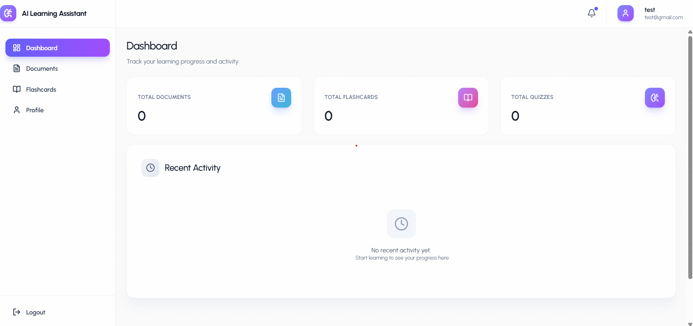
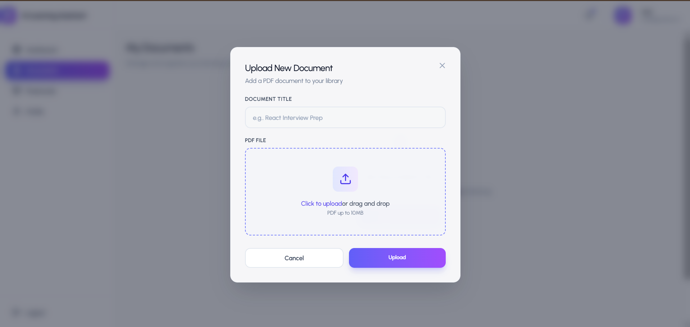

🧠 AI Learning Platform

An AI-powered full-stack learning platform that transforms documents into structured summaries, quizzes, and flashcards using generative AI.

Built with React, Node.js, MongoDB, and Gemini API, this platform reduces manual study effort by automating content understanding and knowledge testing.

🚀 Live Demo

🌐 Frontend:-----

🔗 Backend API:-----

📌 Table of Contents

Overview

Features

Tech Stack

System Architecture

Project Structure

Installation

Environment Variables

API Documentation

Authentication Flow

AI Processing Pipeline

Security Practices

Deployment

Future Improvements

📖 Overview

The AI Learning Platform enables users to:

Upload PDF documents

Generate AI-powered summaries

Create quizzes automatically

Generate flashcards

Track quiz performance

The platform integrates Google Gemini API for structured AI content generation and uses MongoDB for persistent storage.

✨ Features
🔐 Authentication

JWT-based authentication

Password hashing using bcrypt

Protected routes middleware

📄 Document Processing

PDF upload with file validation

Text extraction using pdf-parse

Structured AI prompt generation

🤖 AI Capabilities

Summarization

Multiple-choice quiz generation

Flashcard generation

Structured JSON AI response validation

📊 Quiz System

Score calculation

Answer validation

Performance tracking

🎨 UI/UX

Responsive design

Modern UI with Tailwind CSS

Interactive quiz cards

Loading & transition animations

🛠 Tech Stack
Frontend

React

React Router

Tailwind CSS

Axios

Lucide Icons

Backend

Node.js

Express.js

MongoDB

Mongoose

JWT

bcrypt

Multer

pdf-parse

AI Integration

Google Gemini API

Deployment

Frontend → Vercel

Backend → Render

Database → MongoDB Atlas

🏗 System Architecture

frontend (React)
↓
REST API (Express)
↓
MongoDB Database
↓
Gemini API (AI Processing)

📂 Project Structure
ai-learning-platform/
│
├── frontend/ # React Frontend
│ ├── components/
│ ├── pages/
│ ├── hooks/
│ └── utils/
│
├── backend/ # Node Backend
│ ├── controllers/
│ ├── models/
│ ├── routes/
│ ├── middleware/
│ ├── utils/
│ └── config/
│
└── README.md

⚙️ Installation
1️⃣ Clone Repository
git clone https://github.com/Rahulmkd/Ai-learning-App.git
cd ai-learning-platform
2️⃣ Setup Backend
cd backend
npm install
npm run dev
3️⃣ Setup Frontend
cd frontend
npm install
npm run dev
🔑 Environment Variables

Create a .env file inside /backend:

PORT=5000
MONGO_URI=your_mongodb_connection_string
JWT_SECRET=your_secret_key
GEMINI_API_KEY=your_gemini_api_key
🔌 API Documentation
🔐 Auth Routes
Register User

POST /api/auth/register

Request:

{
"name": "test",
"email": "test@gmail.com",
"password": "test@123"
}

Response:

{
"token": "jwt_token"
}
Login User

POST /api/auth/login

📄 Document Routes
Upload Document

POST /api/documents/upload

Accepts: PDF file

Returns:

Summary

Quiz questions

Flashcards

Get All Documents

GET /api/documents

📝 Quiz Routes
Submit Quiz

POST /api/quiz/submit

🔐 Authentication Flow

User registers

Password hashed using bcrypt

JWT token generated

Token sent to frontend

Protected routes validated via middleware

🤖 AI Processing Pipeline

User uploads PDF

Text extracted using pdf-parse

Structured prompt created

Gemini API generates:

Summary

Quiz

Flashcards

Backend validates JSON structure

Data stored in MongoDB

Frontend renders AI output

🛡 Security Practices

Password hashing (bcrypt)

JWT expiration handling

File type validation (PDF only)

Input validation with express-validator

Error handling middleware

Environment variable protection

🚀 Deployment
Frontend

Deploy using:

Vercel

Backend

Deploy using:

Render

Database

MongoDB Atlas

📈 Future Improvements

Role-based access control

AI chat assistant

Real-time collaboration

Analytics dashboard

Payment integration

Admin panel

test@gmail.com
test@123

🧪 Testing

Manual API testing via apidog

Error handling validation

Edge-case AI response handling

📷 Screenshots (Add Images Here)

Add:

Dashboard

Upload Page

Quiz Interface

Flashcards Page

👨‍💻 Author

Rahul Mkd

Full Stack Developer | AI Enthusiast
Building AI-driven learning systems 🚀

⭐ If You Like This Project

Give it a ⭐ on GitHub!
