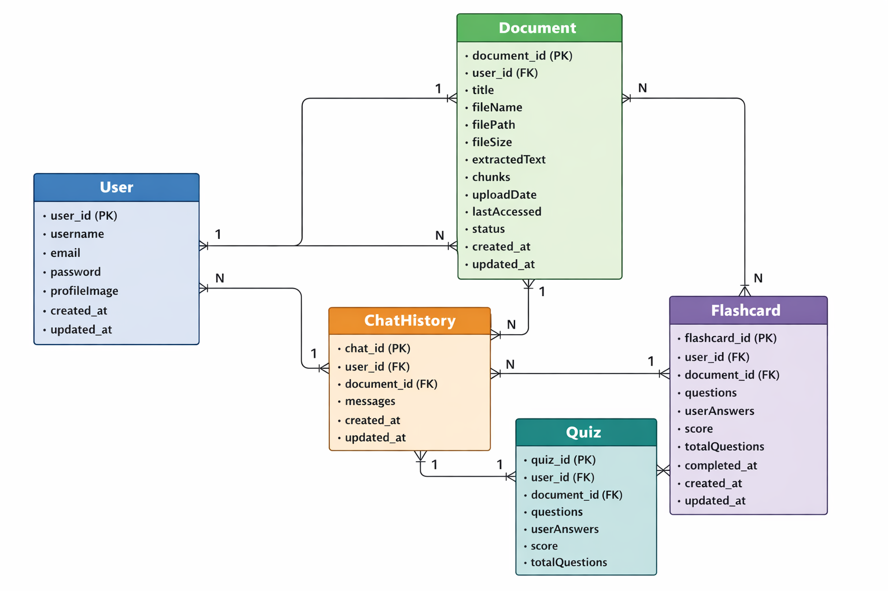
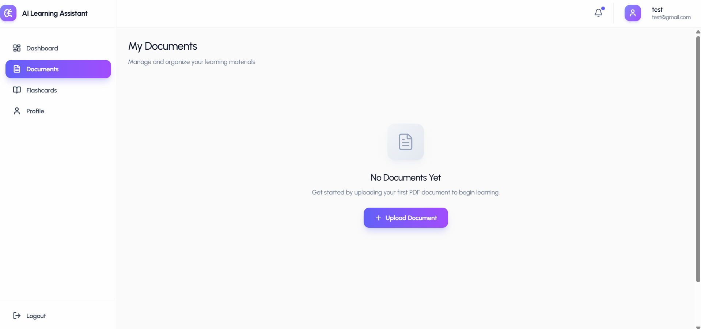
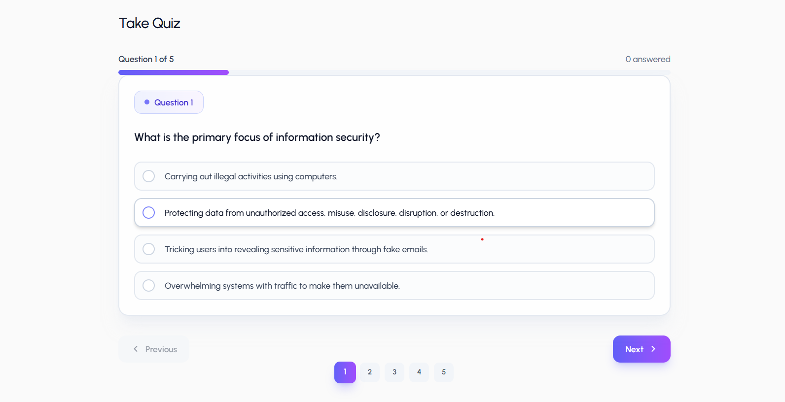
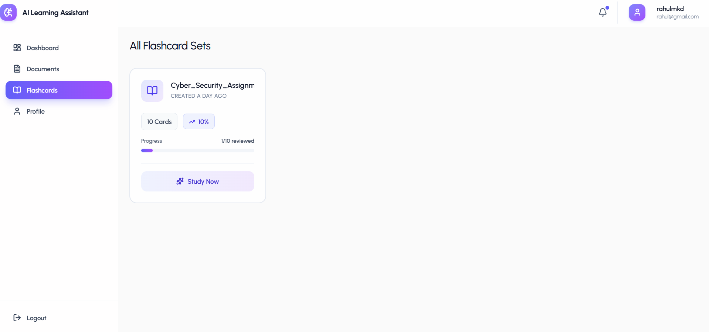

# 🧠 AI Learning Platform

An AI-powered full-stack learning platform that transforms documents into structured summaries, quizzes, and flashcards using generative AI.

Built with React, Node.js, MongoDB, and Google Gemini API, this platform reduces manual study effort by automating content understanding and knowledge testing.

---

## 🚀 Live Demo

🌐 link- https://ai-learning-app-smoky.vercel.app

## For testing perpose

Email id - test@gmail.com
Password - Test@123

---

## 📌 Table of Contents

- [Overview](#-overview)
- [Features](#-features)
- [Tech Stack](#-tech-stack)
- [System Architecture](#-system-architecture)
- [Project Structure](#-project-structure)
- [Installation](#-installation)
- [Environment Variables](#-environment-variables)
- [API Documentation](#-api-documentation)
- [Authentication Flow](#-authentication-flow)
- [AI Processing Pipeline](#-ai-processing-pipeline)
- [Security Practices](#-security-practices)
- [Deployment](#-deployment)
- [Future Improvements](#-future-improvements)
- [Screenshots](#-screenshots)

---

## 📖 Overview

The AI Learning Platform enables users to:

- 📄 Upload PDF documents
- 🧠 Generate AI-powered summaries
- ❓ Create quizzes automatically
- 🗂 Generate flashcards
- 📊 Track quiz performance

The platform integrates Google Gemini API for structured AI content generation and uses MongoDB for persistent storage.

---

## ✨ Features

### 🔐 Authentication

- JWT-based authentication
- Password hashing using bcrypt
- Protected routes middleware

### 📄 Document Processing

- PDF upload with file validation
- Text extraction using pdf-parse
- Structured AI prompt generation

### 🤖 AI Capabilities

- Summarization
- Multiple-choice quiz generation
- Flashcard generation
- Structured JSON AI response validation

### 📊 Quiz System

- Score calculation
- Answer validation
- Performance tracking

### 🎨 UI/UX

- Fully responsive design
- Modern UI with Tailwind CSS
- Interactive quiz cards
- Loading & transition animations

---

## 🛠 Tech Stack

### Frontend

- React
- React Router
- Tailwind CSS
- Axios
- Lucide Icons

### Backend

- Node.js
- Express.js
- MongoDB
- Mongoose
- JWT
- bcrypt
- Multer
- pdf-parse

### AI Integration

- Google Gemini API

### Deployment

- Frontend → Vercel
- Backend → Render
- Database → MongoDB Atlas

---

## 🏗 System Architecture

```
Frontend (React)
        ↓
REST API (Express)
        ↓
MongoDB Database
        ↓
Gemini API (AI Processing)
```

---

## 📂 Project Structure

```
ai-learning-platform/
│
├── frontend/          # React Frontend
│   ├── components/
│   ├── pages/
│   ├── hooks/
│   └── utils/
│
├── backend/           # Node Backend
│   ├── controllers/
│   ├── models/
│   ├── routes/
│   ├── middleware/
│   ├── utils/
│   └── config/
│
└── README.md
```

---

## ⚙️ Installation

### 1️⃣ Clone Repository

```bash
git clone https://github.com/Rahulmkd/Ai-learning-App.git
cd Ai-learning-App
```

### 2️⃣ Setup Backend

```bash
cd backend
npm install
npm run dev
```

### 3️⃣ Setup Frontend

```bash
cd frontend
npm install
npm run dev
```

---

## 🔑 Environment Variables

Create a `.env` file inside `/backend`:

```env
PORT=5000
MONGO_URI=your_mongodb_connection_string
JWT_SECRET=your_secret_key
GEMINI_API_KEY=your_gemini_api_key
```

---

## 🔌 API Documentation

### 🔐 Auth Routes

#### Register User

`POST /api/auth/register`

**Request**

```json
{
  "name": "test",
  "email": "test@gmail.com",
  "password": "test@123"
}
```

**Response**

```json
{
  "token": "jwt_token"
}
```

#### Login User

`POST /api/auth/login`

---

### 📄 Document Routes

#### Upload Document

`POST /api/documents/upload`

- Accepts: PDF file
- Returns:
  - Summary
  - Quiz questions
  - Flashcards

#### Get All Documents

`GET /api/documents`

---

### 📝 Quiz Routes

#### Submit Quiz

`POST /api/quiz/submit`

---

## 🔐 Authentication Flow

1. User registers
2. Password hashed using bcrypt
3. JWT token generated
4. Token sent to frontend
5. Protected routes validated via middleware

---

## 🤖 AI Processing Pipeline

1. User uploads PDF
2. Text extracted using pdf-parse
3. Structured prompt created
4. Gemini API generates:
   - Summary
   - Quiz
   - Flashcards
5. Backend validates JSON structure
6. Data stored in MongoDB
7. Frontend renders AI output

---

## 🛡 Security Practices

- Password hashing (bcrypt)
- JWT expiration handling
- File type validation (PDF only)
- Input validation (express-validator)
- Centralized error handling middleware
- Environment variable protection

---

## 🚀 Deployment

### Frontend

Deploy using:

- Vercel

### Backend

Deploy using:

- Render

### Database

- MongoDB Atlas

---

## 📈 Future Improvements

- Role-based access control
- AI chat assistant
- Real-time collaboration
- Analytics dashboard
- Payment integration
- Admin panel

---

## 🧪 Testing

- Manual API testing via Apidog
- Error handling validation
- Edge-case AI response handling

Test Credentials:

```
Email: test@gmail.com
Password: test@123
```

---

## 📷 Screenshots

### ER Diagram Database



### Dashboard


### Upload Page




### Quiz Interface



### Flashcards Page



---

## 👨‍💻 Author

**Rahul Mkd**  
Full Stack Developer | AI Enthusiast  
Building AI-driven learning systems 🚀

---

## ⭐ Support

If you like this project, give it a ⭐ on GitHub!
